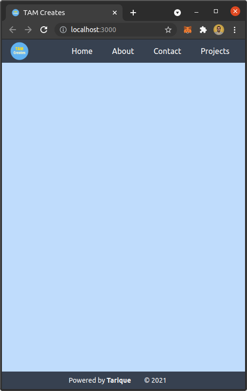
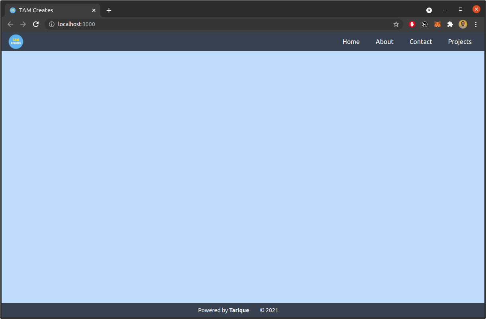
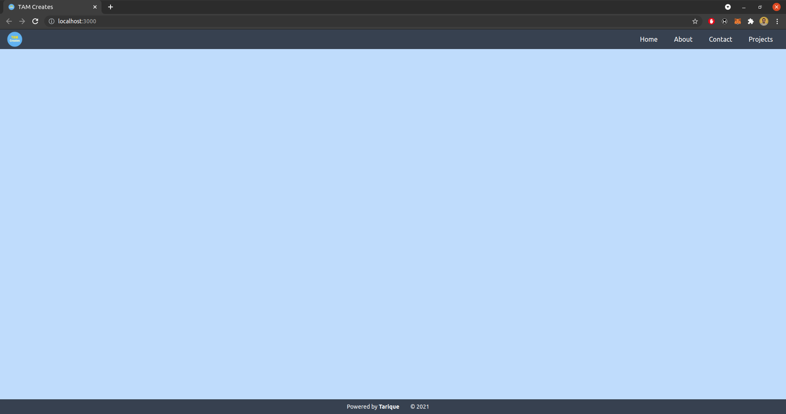

This is a template repository that has a responsive Navigation, Footer, and a Canvas element filling everything in between. :sassy_man:

## Built with

The following technologies are used in this template.

- [ReactJS](https://reactjs.org/) - For UI :+1:
- [NextJS](https://nextjs.com/) - For server side rendering of the React UI :cowboy_hat_face:
- [TypeScript](https://www.typescriptlang.org/) - For static types :sunglasses:
- [TailwindCSS](https://tailwindcss.com/) - For CSS :zipper_mouth_face:
- [PostCSS](https://postcss.org/) - To minify CSS file for production :smirk:

## Screenshots

A few screenshots are attached. :nerd_face:

### Extra small :baby:

### Medium Screen :boy:

### Large Screen :man:

## Creator

- [Tarique](https://github.com/tarique1988) :man_technologist:
